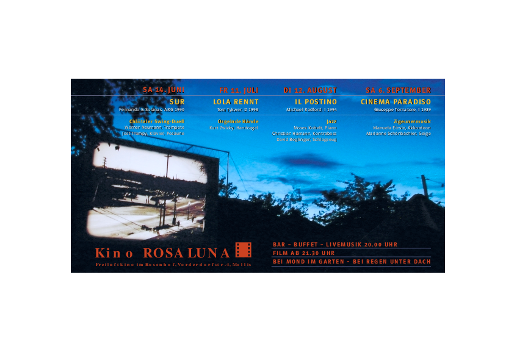

### 2004
<table class='program'>
    <tr>
    <td class='program'>
Die Schweizermacher
    </td>
    <td rowspan="4" class="program-td" >
    
    </td>
    </tr>
    <tr><td>
Bäckerei Zürrer
    </td></tr>
    <tr><td>
El lado oscuro del corazon
    </td></tr>
    <tr><td>
Ta Dona
    </td></tr>
</table>

### 2003
<table class='program' >
    <tr>
    <td class='program'>
Sur
    </td>
    <td rowspan="4" align="top" >
    
    </td>
    </tr>
    <tr><td>
Lola rennt
    </td></tr>
    <tr><td>
Il postino
    </td></tr>
    <tr><td>
Cinema paradiso
    </td></tr>
</table>

### 2002
<table class='program' >
    <tr>
    <td class='program'>
Stranger on an train
    </td>
    <td rowspan="4" align="top" >
    
    </td>
    </tr>
    <tr><td>
Signers Koffer
    </td></tr>
    <tr><td>
Das verlorene Halsband der Taube
    </td></tr>
    <tr><td>
Das Leben ist eine Baustelle
    </td></tr>
</table>

### 2001
<table class='program' >
    <tr>
    <td class='program'>
The english patient
    </td>
    <td rowspan="4" align="top" >
    
    </td>
    </tr>
    <tr><td>
Les petites fugues
    </td></tr>
    <tr><td>
Antonias Welt
    </td></tr>
    <tr><td>
Milagro
    </td></tr>
</table>

### 2000

<table class='program' >
    <tr>
    <td class='program'>
Butch Cassidi and the Sundance Kid
    </td>
    <td rowspan="4" align="top" >
    
    </td>
    </tr>
    <tr><td>
Tati: Jour de fête
    </td></tr>
    <tr><td>
Smoke
    </td></tr>
    <tr><td>
Paris, Texas
    </td></tr>
</table>

