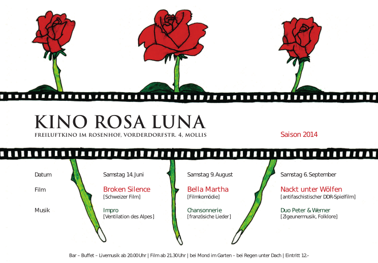
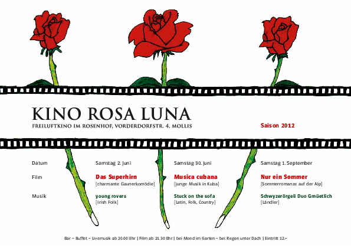
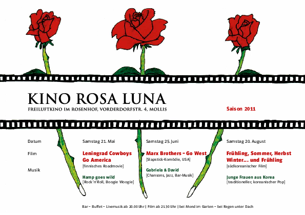
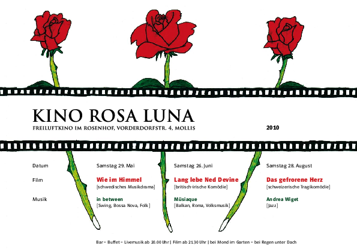

### 2014
<table class='program'>
    <tr>
    <td class='program'>
Broken silence
  </td>
    <td rowspan="4" class="program-td" >
    
    </td>
    </tr>
    <tr><td>
Bella Martha
    </td></tr>
    <tr><td>
Nackt unter Wölfen
    </td></tr>
</table>

### 2013
<table class='program' >
    <tr>
    <td class='program'>
Local Hero
    </td>
    <td rowspan="4" align="top" >
    
    </td>
    </tr>
    <tr><td>
Il bacio di Toska
    </td></tr>
    <tr><td>
Allegro ma non troppo
    </td></tr>
</table>

### 2012
<table class='program' >
    <tr>
    <td class='program'>
Das Superhirn
    </td>
    <td rowspan="4" align="top" >
    
    </td>
    </tr>
    <tr><td>
Musica Cubana
    </td></tr>
    <tr><td>
Nur ein Sommer
    </td></tr>
</table>

### 2011
<table class='program' >
    <tr>
    <td class='program'>
Lenningrad Cowboys go America
    </td>
    <td rowspan="4" align="top" >
    
    </td>
    </tr>
    <tr><td>
Marx Brothers - Go West
    </td></tr>
    <tr><td>
Frühling, Sommer, Herbst, Winter...und Frühling
    </td></tr>
</table>

### 2010

<table class='program' >
    <tr>
    <td class='program'>
Wie im Himmel
    </td>
    <td rowspan="4" align="top" >
    
    </td>
    </tr>
    <tr><td>
Long live Ned Devine
    </td></tr>
    <tr><td>
Das gefrorene Herz
    </td></tr>
</table>

