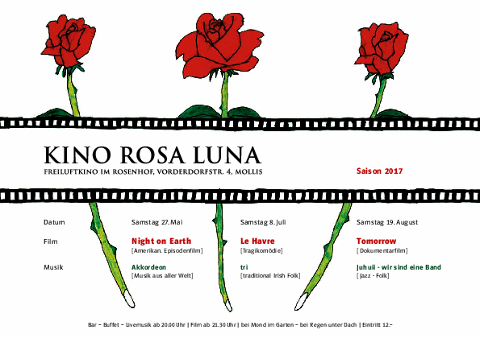

### 2017
<table class='program'>
    <tr>
    <td class='program'>
Heaven can wait
  </td>
    <td rowspan="4" class="program-td" >
    
    </td>
    </tr>
    <tr><td>
Der grüne Planet
    </td></tr>
    <tr><td>
Rhythm is It!
    </td></tr>
</table>

### 2016
<table class='program'>
    <tr>
    <td class='program'>
Heaven can wait
  </td>
    <td rowspan="4" class="program-td" >
    
    </td>
    </tr>
    <tr><td>
Der grüne Planet
    </td></tr>
    <tr><td>
Rhythm is It!
    </td></tr>
</table>

### 2015
<table class='program' >
    <tr>
    <td class='program'>
    </td>
    </tr>
    <tr>
    <td>
    legte das Rosa-Luna Team eine schöpferische Pause ein
    </td>
    </tr>
</table>
