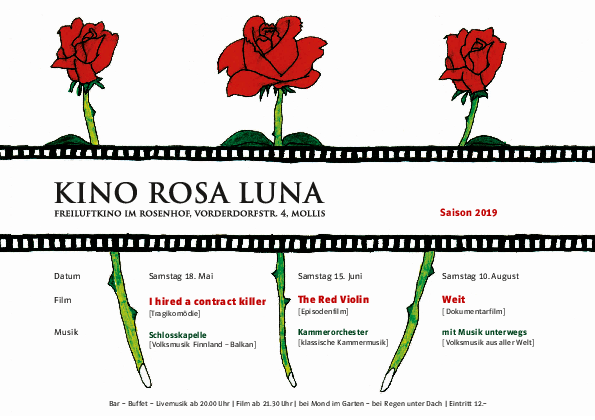

Auch 2019 offerieren wir den Molliser drei gemütliche Abende.

Wir treffen uns sich ab 20 Uhr im Garten des Rosenhofs von Mollis. Musik begleitet uns in den Abend und zu allerlei Leckereien geniesst man ein Glas Wein, Sangria, Überraschungsbowle, Bier oder Wasser.

Nach dem Einbruch der Dunkelheit wird gegen 21 Uhr 45 der Film gestartet. Einige Leute nehmen zur Sicherheit ihre Wolldecke selber mit. Bei schlechtem Wetter können wir in die Kirche ausweichen. Der Eintritt kostet Fr. 12.-.

Das Programm sieht wie folgt aus:

##  Samstag 18. Mai 2019

**I hired a contract killer (Vertrag mit meinem Killer)**

Tragikkomödie von Aki Kaurismäki (1990) mit Jean-Pierre Léaud, Margi Clarke, Kenneth Colley

Henri Boulanger hat kein Glück im Leben. Als man ihn nach 15 Jahren Dienst
bei den Wasserwerken entlässt, beschliesst er, sich umzubringen. Seine Versuche in dieser Richtung scheitern jedoch kläglich, und er
fühlt sich feige. So heuert Monsieur Boulanger einen Auftragskiller an, der ihm in den nächsten Tagen einen Besuch abstatten soll. Doch
ausgerechnet jetzt verliebt er sich in die betörende Blumenverkäuferin Margaret ...

Volksmusik Finnland/Balkan ab 20 Uhr:  **: Manuela Einsle-Vetterli & Lukas Wissler (Geige, Blöckflöte, Akkordeon)**

## Samstag 15. Juni 2019

**The Red Violin (Die rote Violine)**

Episodenfilm von François Girard,  Kanada, 1998 | 125 Minuten  mit Carlo Cecchi, Jean-Luc Bideau, Greta Scacchi

Ein Auktionator in Montreal versteigert verschiedene Streichinstrumente, u. a.
die sogenannte rote Violine. Der Film zeigt Entstehung und Lebenslauf des besonderen Musikinstruments, welches vom italienischen 
­Geigenbaumeister Nicolo Bussotti aus Cremona im Jahre 1681 erbaut worden ist. Als seine Frau bei der Geburt stirbt, mischt der
tief erschütterte Mann das Blut seiner geliebten Frau in den Lack und färbt damit seine Violine – sein letztes Werk – rot. Der Film erzählt
die über Jahrhunderte reichende wechselvolle, oft tragische Geschichte der Violine und deren Besitzern, die von ihr immer wieder in
einen magischen Bann gezogen werden.

Klassische Musik ab 20 Uhr: **Formationen des Glarner Kammerorchesters (Streichinstrumente)**

## Samstag 10. August 2019

**Weit - Die Geschichte von einem Weg um die Welt**

Dokumentarfilm von Gwendolin Weisser und Patrick Allgaier | 2017 | 127 Minuten

Das junge Paar, Gwendolin Weisser und Patrick Allgaier, reist – ohne je in ein Flugzeug zu steigen – rund um die Welt. Dreieinhalb Jahre und 50’000 km später treffen sie mit einem Sohn wieder zu Hause ein. Der Film besticht durch die Abenteuerlust seiner Protagonisten ebenso wie durch Aufnahmen aus weitabgelegenen Landstrichen. Was ursprünglich als kleine, familiäre Reisedokumentation geplant war, wird unerwartet zum Kino-Geheimtipp. Der Film zeigt eine Menschlichkeit, die über Grenzen und Nationen, Kulturen und Religionen hinweg existiert, die Hoffnung macht und uns ohne Wenn und Aber verbindet.

Volksmusik aus aller Welt ab 20 Uhr: **Felizitas Allgäuer (Geige), Michael Burtscher (Akkordeon u. Gesang), Andreas Habert (Flöten)**
