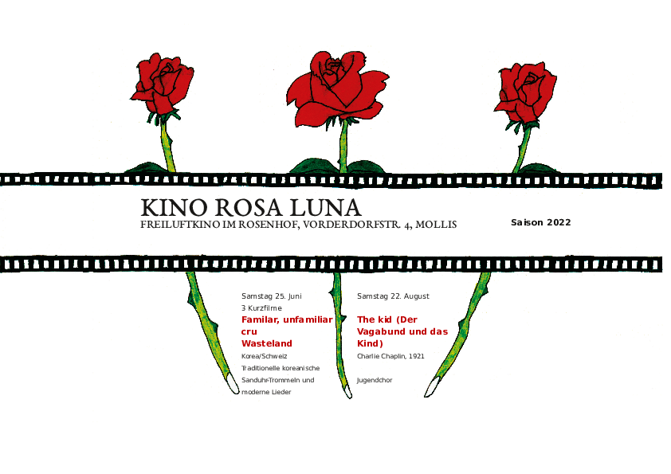

Wir treffen uns sich ab 20 Uhr im Garten des Rosenhofs von Mollis. Musik begleitet uns in den Abend und zu allerlei Leckereien geniesst man ein Glas Wein, Sangria, Überraschungsbowle, Bier oder Wasser.

Nach dem Einbruch der Dunkelheit wird gegen 21 Uhr 45 der Film gestartet. Einige Leute nehmen zur Sicherheit ihre Wolldecke selber mit. Bei schlechtem Wetter können wir in die MZH ausweichen. Der Eintritt kostet Fr. 12.-.

Das Programm sieht wie folgt aus:

##  Samstag 25. Juni 2022

**3 Kurzfilme**

**cru (Roh)**

Von David Oesch. 10 Minuten, 2019. Eine [Abschlussarbeit](https://medienarchiv.zhdk.ch/sets/1551f149-6cbd-4202-bff1-2610ef16bd08) an der ZHdK.

Eine junge Köchin verfolgt eisern ihre Karriere.

Doch um die Chefin zu beeindrucken und in der Hackordnung aufzusteigen, braucht es in dieser Küche keine Kreativität, sondern Blut, Schweiss und Tränen.

**Familar, unfamiliar (gewohnt, ungewohnt)**

Ein [Kurzfilm](https://www.haesup.com/unfamiliar-familiar) von 28 Min von Hae-Sup Sin, 2021.

Die Schweiz-Koreanerin SANGHWA (50) fliegt inmitten der Pandemie nach Korea, nachdem sie die Todesnachricht ihrer Mutter erhalten hat. Auf Grund der Corona-Massnahmen verbringt sie ihre obligatorische Quarantäne im verlassenen Elternhaus. Dort wird sie mit vertrauten, aber gleichzeitig fremden Gefühlen aus ihrer Vergangenheit und Gegenwart konfrontiert.

Der Filme wurde mit dem "Treatment Award" der Zuger Filmtage und des Genussfilm Festivals Zug, ist ein selbstproduziertes, fiktionales Kurzfilmprojekt.

Der Film wurde im April 2021 in Südkorea gedreht und wird seine Weltpremiere am oscar-qualifizierenden Busan International Short Film Festival feiern.

**Wasteland (Brachland)**

Von [Tack Lee](https://mubi.com/films/wasteland-2021), 35 Minuten, 2021

Hwacheon bittet ihre Nachbarin Seoams darum, die Leiche ihres Mannes, der Selbstmord begangen hat, in Seoams Hinterhof zu begraben.

Der Film gewann 2021 zwei Preise am südkoreanischen Jeonju Filmvestival und 2022 Internationalen Kurzfilm-Festival von Clermont-Ferrand.

Musik ab 20 Uhr:  **Traditionelle koreanische Sanduhr-Trommeln und moderne Lieder**

## Samstag 20. August 2022

**The kid (Der Vagabund und das Kind)**

[comment]:https://www.sfvasdf.ch/rsd/?movienr=0071.464 (Niemand) oder Disney (https://www.sfvasdf.ch/rsd/?movienr=1002.973) ? infoCH@disney.com

The Kid, in Deutschland auch bekannt als Der Vagabund und das Kind, ist eine US-amerikanische Stummfilm-Tragikomödie von Charlie Chaplin aus dem Jahre 1921. Die Hauptrollen übernehmen Charlie Chaplin, Edna Purviance sowie Jackie Coogan, der durch diesen Film zum Kinderstar wurde. Charles Chaplins erster Langfilm als Regisseur handelt von einem Tramp, der ein kleines Kind findet und es aufzieht. Durch äußere Umstände gerät die innige Beziehung zwischen den beiden allerdings in Gefahr. Der Film verknüpft Komödie mit Sozialdrama, was zu dieser Zeit fast einmalig war. The Kid war ein großer Kassenerfolg seiner Zeit und zählt noch heute zu Chaplins berühmtesten Werken. 2011 wurde der Film ins National Film Registry aufgenommen. 

Musik ab 20 Uhr:  **Jugendchor**
