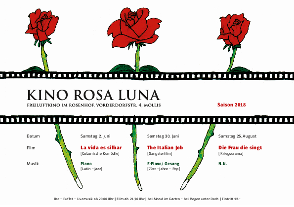

Auch 2018 offerieren wir den Molliser drei gemütliche Abende.

Wir treffen uns sich ab 20 Uhr im Garten des Rosenhofs von Mollis. Musik begleitet uns in den Abend und zu allerlei Leckereien geniesst man ein Glas Wein, Sangria, Überraschungsbowle, Bier oder Wasser.

Nach dem Einbruch der Dunkelheit wird gegen 21 Uhr 45 der Film gestartet. Einige Leute nehmen zur Sicherheit ihre Wolldecke selber mit. Bei schlechtem Wetter können wir in die Kirche ausweichen. Der Eintritt kostet Fr. 12.-.

Das Programm sieht wie folgt aus:

##  Samstag 2. Juni 2018

**La vida es silbar (Das Leben ist Pfeifen)**

Musik ab 20 Uhr:  **Roger Näf (Piano, Latin - Jazz)**

## Samstag 30. Juni 2018

**The Italian Job (Jagd auf Millionen)**

Musik ab 20 Uhr: **Chris Glarner (E-Piano & Gesang, 70 er – Jahre – Pop)**

## Samstag 25. August 2018

**Incendies (Die Frau die singt)**

Musik ab 20 Uhr:  noch offen
