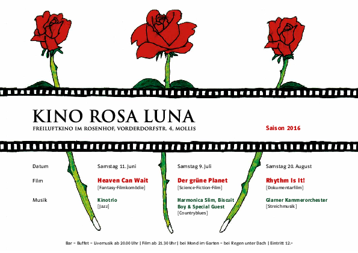

Nachdem das Team 2015 eine schöpferischen Pause eingelegt hat, haben wir uns für 2016 wieder vorgenommen, den Molliser und anderen Film-Interessierten drei gemütliche Abende zu offerieren.

<table>
  <tr border='none' >
    <td>
Samstag 11. Juni 2016
    <td>
    <td colspan="2" rowspan="4" class="program-td" >
<a href="archiv/Flyer_2016.pdf">

    </td>
  <tr>
  </tr>
    <td>
Samstag 9. Juli 2016
    </td>
  <tr>
    <td>
Samstag 20. August 2016
    </td>
  </tr>

  <tr>
    <td colspan="4" class="program-td" >
</td>
  </tr>
</table>

Wie gewohnt trifft man sich ab 20 Uhr im Garten des Rosenhofs von Mollis. Musik begleitet uns in den Abend und zu allerlei Leckereien geniesst man ein Glas Wein, Sangria, Überraschungsbowle, Bier oder Wasser.

Nach dem Einbruch der Dunkelheit wird gegen 21 Uhr 45 der Film gestartet. Einige Leute nehmen zur Sicherheit ihre Wolldecke selber mit. Bei schlechtem Wetter können wir in die Kirche ausweichen.

Merken Sie sich also folgende Daten:
