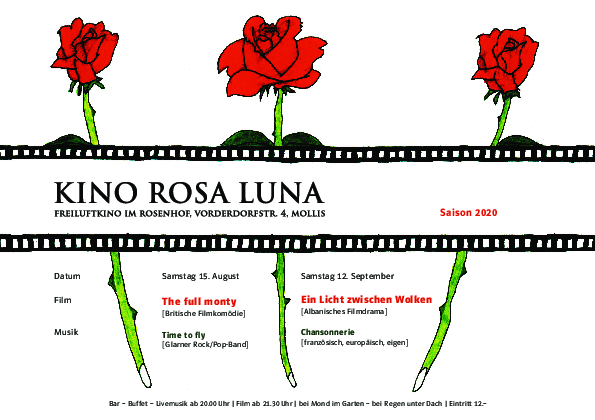

Wegen Corona offerieren wir den Molliser auch 2021 nur zwei gemütliche Abende und machen wenig Werbung, da es nicht klar ist, wieviele Leute teilnehmen dürfen.

Wir treffen uns sich ab 20 Uhr im Garten des Rosenhofs von Mollis. Musik begleitet uns in den Abend und zu allerlei Leckereien geniesst man ein Glas Wein, Sangria, Überraschungsbowle, Bier oder Wasser.

Nach dem Einbruch der Dunkelheit wird gegen 21 Uhr 45 der Film gestartet. Einige Leute nehmen zur Sicherheit ihre Wolldecke selber mit. Bei schlechtem Wetter können wir in die MZH ausweichen. Der Eintritt kostet Fr. 12.-.

Das Programm sieht wie folgt aus:

##  Samstag 21. August 2021

**Parasite**

[comment]: Rechteinhaber Filmcoopi

Südkoreanischer Spielfilm von Bong Joon-ho, 2019 | 132 Minuten mit Song Kang-ho, Lee Sun-kyun, Cho Yeo-jeong

Er dreht sich um den Sohn einer armen Familie, der einen Job als Privatlehrer bei einer reichen Familie bekommt und mit der Zeit seiner Familie ebenfalls Stellen in dem luxuriösen Anwesen verschafft. Der Film ist eine Mischung aus Drama, Thriller, Parabel, Farce, Satire und Groteske und wurde als Kritik an den südkoreanischen und westlichen Lebens-, Arbeits- und Konsumverhältnissen verstanden.

Musik ab 20 Uhr:  **Traditionelle koreanische Sanduhr-Trommeln und moderne Lieder**

Eventuell vorher noch ein Kurzfilm (10 Minuten) Yori https://vimeo.com/320611463, Preisgekrönter Kurzfilm über die Schwierigkeiten im koreanischen Exil in der Schweiz

## Samstag 11. September 2021

**Film noch nicht definitiv**

Musik ab 20 Uhr: **Rochus Hobi**

